# Documentación del Laboratorio de Gestión de Archivos en HDFS y S3

## Configuración Inicial del Clúster EMR

### Creación del Clúster
- **Nombre del Clúster**: emr-sospinai-cluster-final
- **Versión del Clúster**: 6.14.0
- **Tipo de Instancia**: m4.xlarge
- **Aplicaciones Instaladas**: Hadoop 3.3.3, Hive 3.1.3, Spark 3.4.1, Hue 4.11.0, JupyterHub 1.5.0
- **Configuración de Software**:
  ```json
  {
    "Classification": "jupyter-s3-conf",
    "Properties": {
      "s3.persistence.enabled": "true",
      "s3.persistence.bucket": "sospinainotebooks"
    }
  }
  ```

### Configuración de Seguridad y Conectividad
- **Puertos Abiertos en el Clúster**:
  - Puertos 22, 14000, 9870, 8888, 9443, 8890 habilitados para facilitar el acceso y la funcionalidad de las aplicaciones.

### HUE
- **Usuario**: hadoop
- **Contraseña**: Hadoop2024*
- **Problema Encontrado**:
  Al intentar acceder a los archivos de HDFS, se encontró con el error: "Cannot access: /user/hadoop. The HDFS REST service is not available."
- **Solución**:
  Se editó el archivo `/etc/hue/conf/hue.ini` cambiando el puerto de 14000 a 9870 y se reinició el servicio con `systemctl restart hue.service`.

### JupyterHub
- **Usuario**: jovyan
- **Contraseña**: jupyter
- Se creó y probó un notebook para validar las configuraciones de las variables `spark` y `sc`.


## Gestión de Datasets

### Configuración del bucket:
-Editamos la configuración para que sea de acceso publico:
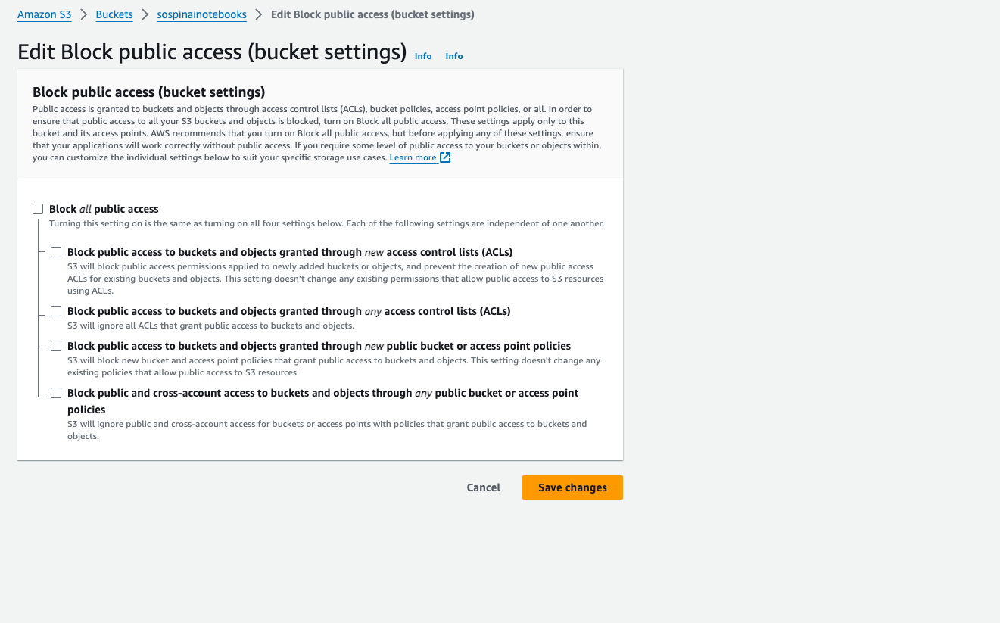
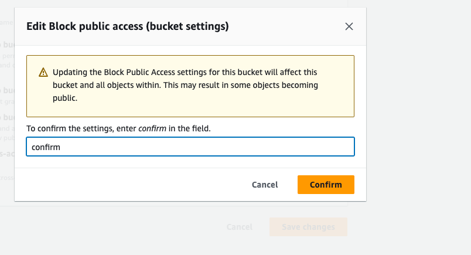
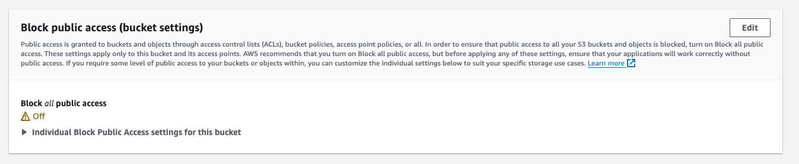

A continuación se mostraran imagenes de como se practico la gestión y creación de archivos.

### Copiar (gestión) de archivos hacia el HDFS vía HUE.
- Los datasets fueron cargados en HDFS bajo el directorio `/user/hadoop/datasets`, asegurando que estén disponibles para análisis y procesamiento.
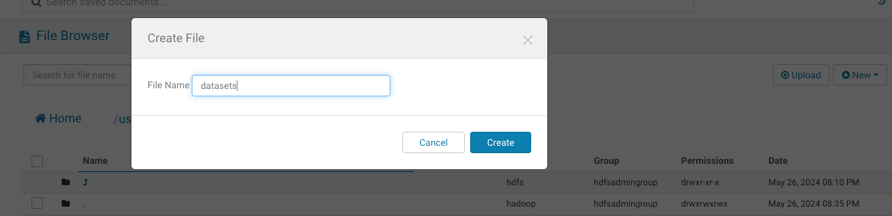
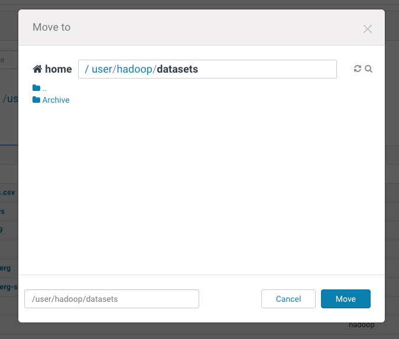

- Subimos el archivo .zip con la informacion de los datasets
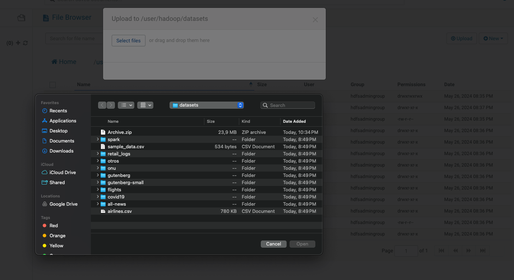

- Sacamos la información del archivo .zip y lo pasamos a la carpeta datasets
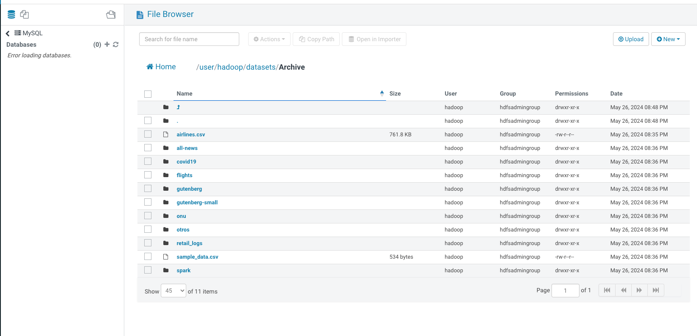
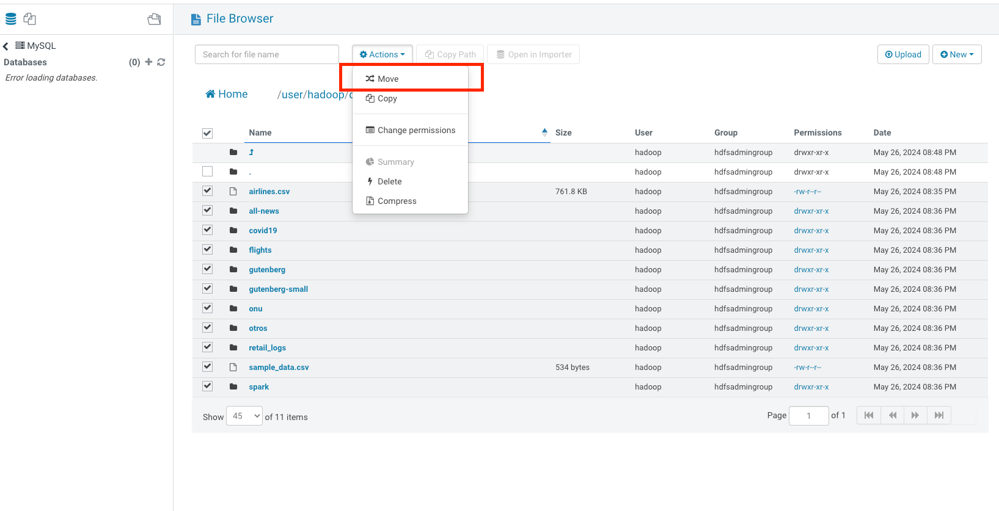

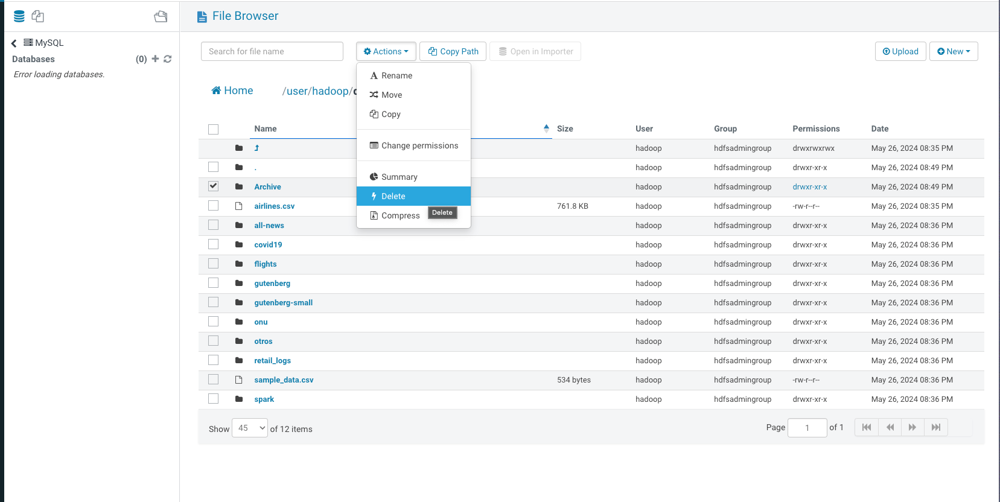
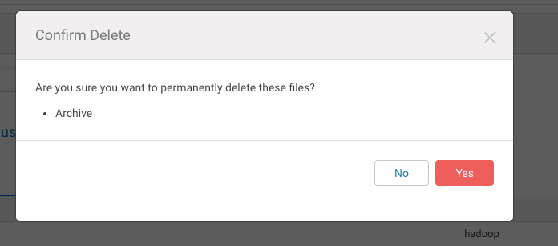
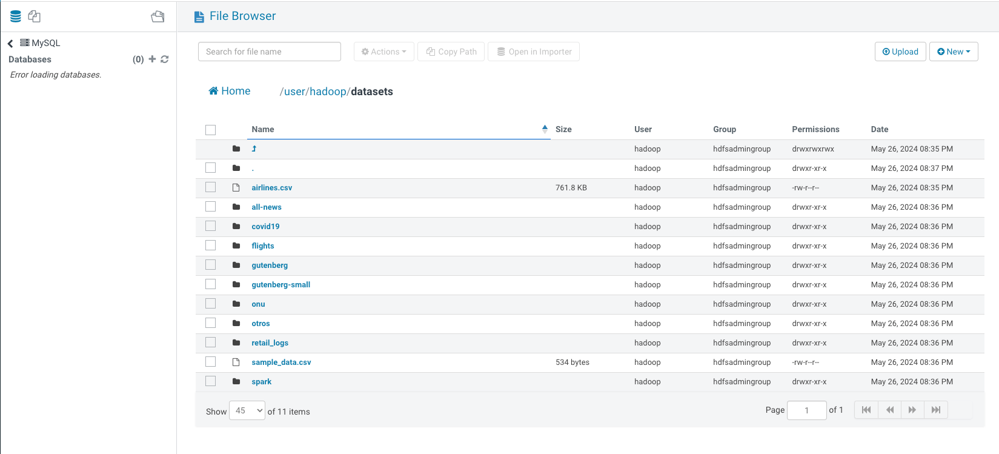

### Copiar (gestión) de archivos hacia el HDFS vía SSH.
- Mostrar lista de carpetas que hay en una ruta:
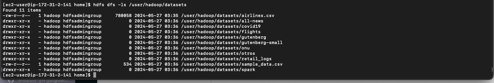

- Mostrar bytes de los archivos dentro de una carpeta:
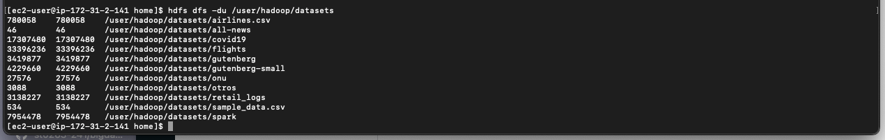

- Mover archivos de una carpeta a otra, y luego eliminar una carpeta
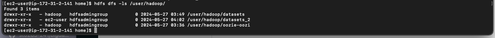
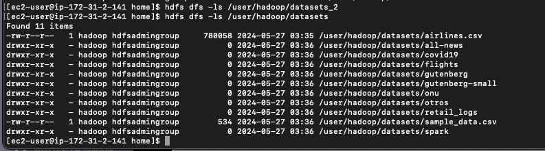
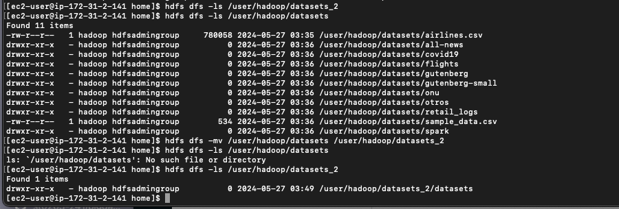
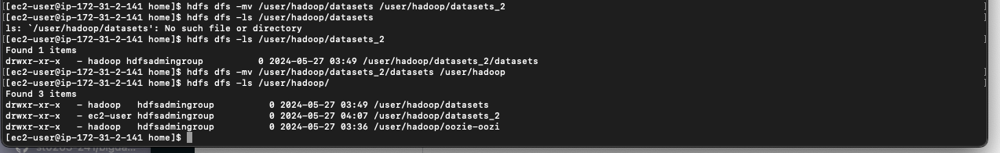
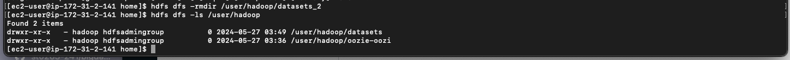

### Copiar (gestión) de archivos hacia AWS S3 vía HUE.
- Para esta gestión usamos HUE en la sección de S3 y creamos un folder para poder cargar los datos de la carpeta ONU del datasets
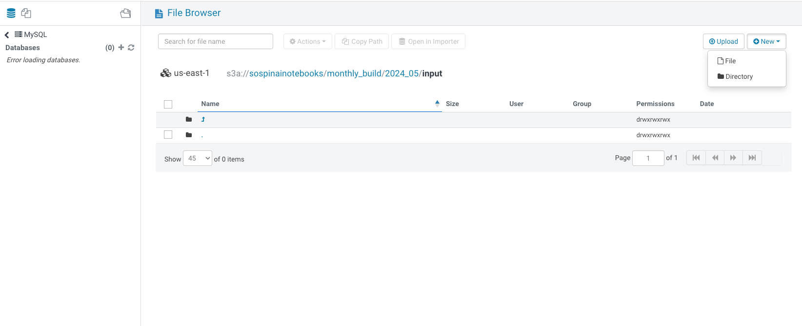
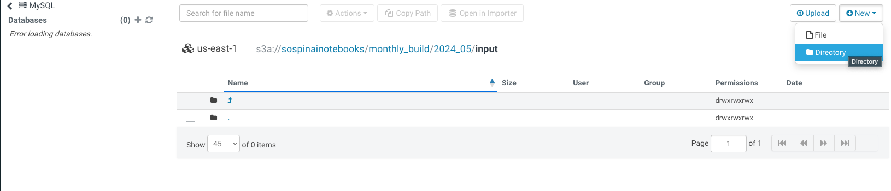
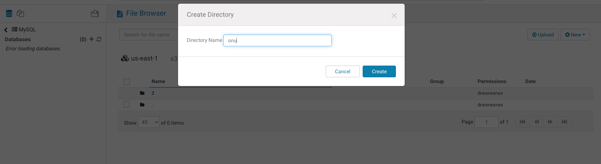
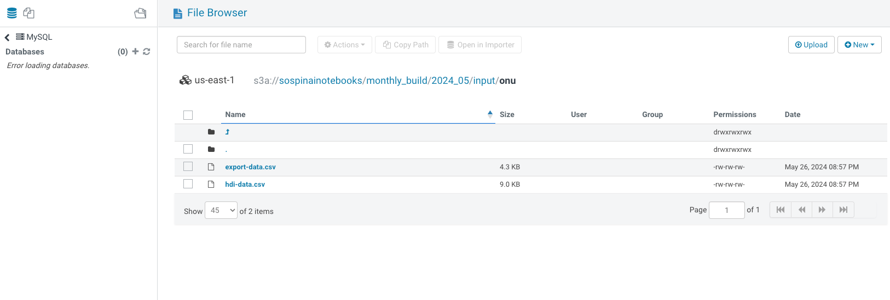

### Copiar (gestión) de archivos hacia el AWS S3 vía SSH.
- Para esta gestión copiamos un archivo desde nuestro HDFS al bucket de S3
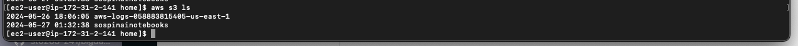
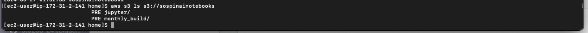
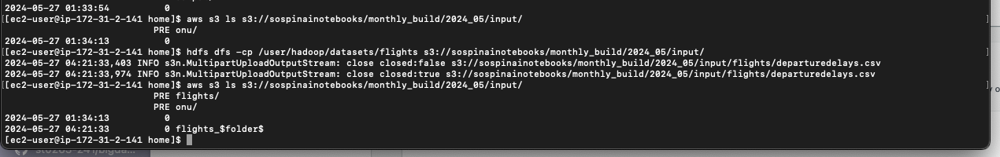

## Conclusión

Este laboratorio demostró la configuración efectiva y la gestión de un entorno EMR para el procesamiento de big data, incluyendo la configuración de seguridad, la resolución de problemas de acceso y la gestión eficiente de datos a gran escala.

## Comandos Útiles

- Conectar vía SSH al nodo master: `ssh -i <your-key>.pem ec2-user@<master-node-ip>`
- Reiniciar servicio HUE: `systemctl restart hue.service`
- Listar archivos en HDFS: `hdfs dfs -ls /user/hadoop/datasets`
