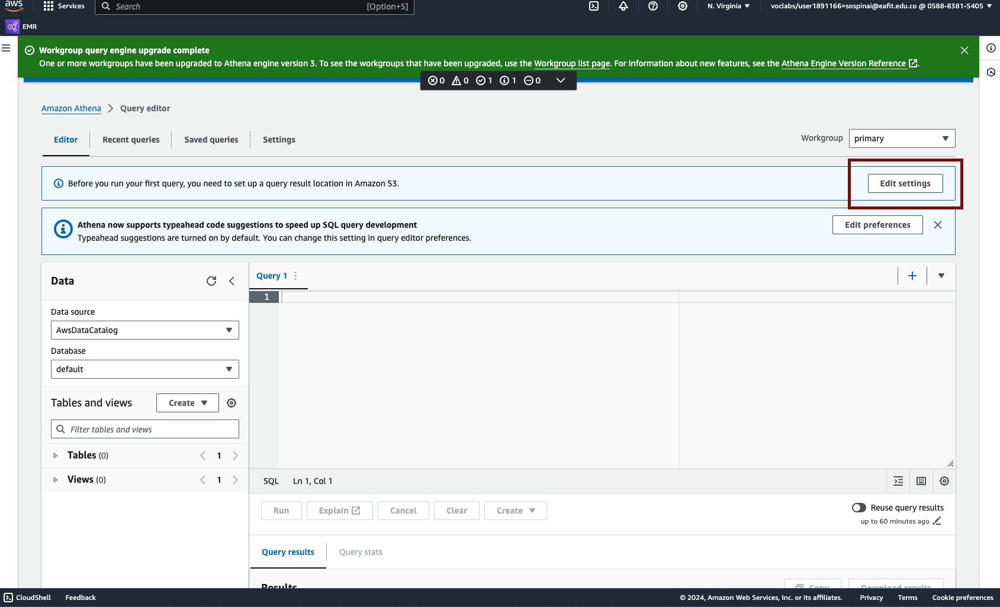

# Laboratorio 3.2: Implementación de un Data Warehouse con AWS S3, Glue y Athena

## Autor
- **Nombres**: Isaac Tadina G y Santiago Ospina I 

## Introducción
Este laboratorio se enfocó en la implementación de un data warehouse sencillo utilizando AWS S3 para almacenamiento, AWS Glue para catalogación y AWS Athena para consultas SQL sobre los datos relacionados con organizaciones internacionales y vuelos.

## Configuración del Entorno
- **AWS S3**: Utilizado para almacenar los datasets `onu` y `flights` en el bucket `sospinainotebooks`, configurando también un directorio de salida `output` para los resultados de Athena.
- **AWS Glue**: Creación de dos bases de datos:
  - `onudb` para datos de la ONU.
  - `flightsdb` para datos de vuelos.
  Crawlers configurados para estructurar estos datos.

  imagenes de creacion de crawlers para catalogar datos:
  
  
  

- **AWS Athena**: Configurado para realizar consultas SQL eficientes sobre las estructuras de datos catalogadas por AWS Glue.

Configuracion del archivo de salida:



## Datos Utilizados
- Datasets de la **ONU** y **Tickit**, así como datos detallados de vuelos.

## Consultas SQL Realizadas
### Base de Datos `onudb`
#### Tabla `export`
1. **Total de Exportaciones por País**:
   ```sql
   SELECT country, SUM(export) AS total_exports FROM onudb.export GROUP BY country ORDER BY total_exports DESC;
   ```
  Sumariza las exportaciones totales por país, ordenadas de mayor a menor.
  

2. **Cinco Países con Mayores Exportaciones:**:
   ```sql
   SELECT country, SUM(export) AS total_exports FROM onudb.export GROUP BY country ORDER BY total_exports DESC LIMIT 5;
   ```
   Muestra los cinco países con las mayores exportaciones registradas.
   

#### Tabla `hdi`
1. **Índice de Desarrollo Humano y Expectativa de Vida:**:
   ```sql
   SELECT country, hdi, lifeex, myschool FROM onudb.hdi WHERE hdi IS NOT NULL ORDER BY hdi DESC;
   ```
   Ordena los países por el Índice de Desarrollo Humano, incluyendo datos de expectativa de vida y años promedio de escolaridad.
   

2. **Países con HDI Inferior a 0.5 y su GNI:**:
   ```sql
   SELECT country, hdi, gni FROM onudb.hdi WHERE hdi < 0.5 ORDER BY hdi;
   ```
   Identifica los países con un bajo índice de desarrollo humano y muestra su Ingreso Nacional Bruto.
   

### Base de Datos `flightsdb`
#### Tabla `flights`
1. **Vuelos con Retrasos Significativos:**:
   ```sql
   SELECT date, origin, destination, delay FROM flightsdb.flights WHERE delay > 60 ORDER BY delay DESC;
   ```
   Identifica los vuelos con retrasos mayores a 60 minutos, listando la fecha, origen y destino.
   

2. **Distancia Media de Vuelo por Aeropuerto de Origen:**:
   ```sql
   SELECT origin, AVG(distance) AS average_distance FROM flightsdb.flights GROUP BY origin;
   ```
   Calcula la distancia media de los vuelos que parten de cada aeropuerto de origen.
   

## Conclusión
- En este laboratorio demostramos la utilidad de AWS S3, Glue y Athena para establecer un data warehouse sencillo pero funcional. Las consultas SQL realizadas permitieron obtener insights valiosos de los datos disponibles, facilitando el análisis y la toma de decisiones basada en datos.

